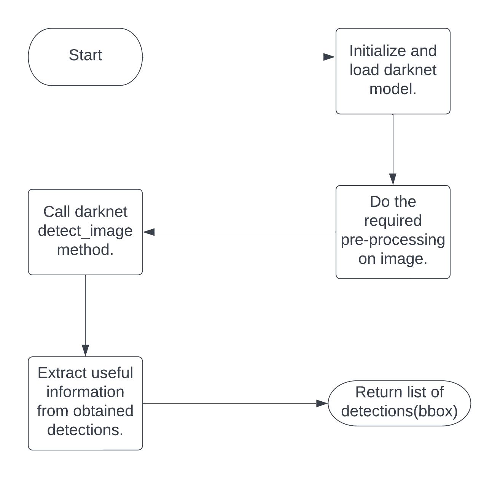

## Object Detection

- [Introduction](#introduction-what-is-yolo)
- [Flowchart](#flowchart)
- [Approach](#approach)
- [Installation](#installation)

### Introduction: What is YOLO?

YOLO is an abbreviation for the term 'You Only Look Once'. This is an algorithm that detects and recognizes various objects in a picture (in real-time). Object detection in YOLO is done as a regression problem and provides the class probabilities of the detected images. We will use YOLO for object detection.

### Flowchart

### Approach

How to get detections using yolov4-model?

#### Step #1: Initialize and load model
Initailze Yolo class by passing weight, config, data, names files and then load YOLO darknet model.

#### Step #2: Detecting image

Do the required pre-processing on image and then call darknet detect image method to get the detections. 

#### Step #3: Extract the required information from detections.

Darknet detect image method returns detections list containing info about class, confidence, bbox of detected objects.

Extract useful information from detections list.

### Installation

>build darknet(https://medium.com/geekculture/yolov4-darknet-installation-and-usage-on-your-system-windows-linux-8dec2cea6e81#a59a)
