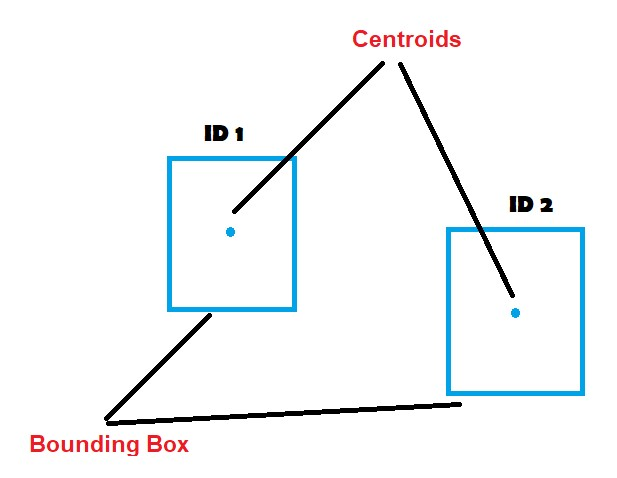
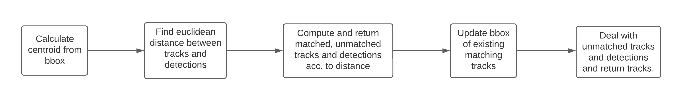

## Centroid Tracker

- [Introduction](#introduction-what-is-centroid-tracker#)
- [Flowchart](#flowchart)
- [Approach](#approach)
- [Installation](#installation)
- [Usage](#usage)

### Introduction: What is Centroid Tracker?

Centroid Tracker works by calculating euclidean distance between existing object centroids (i.e., objects the centroid tracker has already seen before) and new object centroids and assigns id accorrding to the centroids with minimum distances between subsequent frames.




### Flowchart



### Approach

The centroid tracking algorithm is a multi-step process.

#### Step #1: Accept bounding box coordinates and compute centroids.
Once we have the bounding box coordinates we must compute the “centroid”, or more simply, the center (x, y)-coordinates of the bounding box. Our yolo module will give bbox in (x1, y1) amd (x2, y2) format which will be top-left and bottom-right points of bbox. So, centroid will be `x = (x1+x2)/ 2` and `y = (y1+y2)/ 2`

#### Step #2: Compute Euclidean distance between new bounding boxes and existing objects

We then compute the Euclidean distances between each pair of original centroids (tracks) and input centroids (detections).

#### Step #3: Update (x, y)-coordinates of existing objects

We associate centroids with minimum distances between subsequent frames. This method is also known as hungarian algorithm. So the object which are getting matched will stored in `matches` and the ones which are not matched are stored either in `unmatched_tracks` or in `unmatched_detections`.

#### Step #4: Register new objects

If in a frame there more input detections than existing objects being tracked, we need to register the new object. “Registering” simply means that we are adding the new object to our list of tracked objects by:

- Assigning it a new object ID

- Storing the centroid of the bounding box coordinates for that object

We will keep a `hits` for each track object and will increase it count whenever it appears so if object appears for atleast `min_hits` frame then only we will consider it as a object.
  
#### Step #5: Deregister old objects

If in a frame there are less input detections than existing objects being tracks, we need to degister the old objects. There might be cases where the object disappeared for one frame and appeared in next due to any reason, so avoid mutiple time registering degistering, we can set a max disappeared limit as `miss` which will store the consecutive frame till which the object was disappeared. So, if a object's `miss` passes `max_age` threshold we should deregister that object from our track. 

### Installation

```bash
pip install numpy
pip install opencv-python
pip install scipy
```

### Usage

Import and call class of `Centroid_tracker` in main.py and run `python main.py`.
