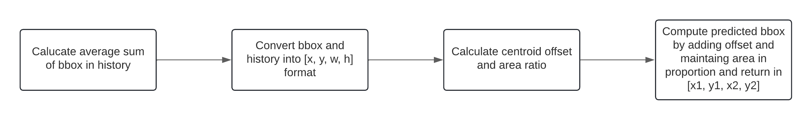

## IoU-Predict Tracker

- [Introduction](#introduction-what-is-iou-predict-tracker)
- [Flowchart](#flowchart)
- [Approach](#approach)
- [Installation](#installation)
- [Usage](#usage)

### Introduction: What is IoU-Predict Tracker?

IoU_predict tracker works by calculating the Intersection over union(IoU) of on previous frames predicted bounding box co-ordinates by velocity model and current frame bounding box coordinates and later applying Hungarian algorithms to all the calculated IoU and we can set a minimum threshold value of IoU to match our detection with our previous tracks. So, this tracker is the same as the previous IoU tracker, but here we are trying to predict the bbox of the previous frames by using our linear velocity model and thus making our tracking more robust and this handles minor occlusions very effectively.

### Flowchart



### Approach

So here the approach is exactly the same as the IoU predict, the only difference is in bbox of trackers, so instead of using the tracker's bbox for calculating the IoU metric with detections, we will be using our predicted bbox which will be an addition of the average sum of their offset of the previous bbox's centroid and also considering the change in bbox area should change proportionately.

We have declared `hiscount` as the number of the previous bbox to be stored in `history`. We are firstly converting bbox format from [x1, y1, x2, y2] to [x, y, w, h] where x and y are bbox centroid co-ordinate and w and h are width and height. So, we are calculating the offset of the centroid from the previous bbox centroid with the current bbox and adding that offset to our predicted bbox. And the same thing with the area, so we are calculating the area ratio of the previous bbox with the current bbox and multiplying with the same ratio in our predicted bbox. And to make it more robust, instead of just storing the previous bbox, we can store a list of the previous bbox, which is stored in `history`(the default size chosen is 5).

### Installation

```bash
pip install numpy
pip install opencv-python
pip install scipy
```

### Usage

Import and call class of `Centroid_tracker` in main.py and run `python main.py`.
