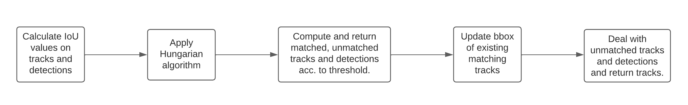

## IoU Tracker

- [Introduction](#introduction-what-is-iou-tracker)
- [What is IoU?](#theory-what-is-iou)
- [Flowchart](#flowchart)
- [Approach](#approach)
- [Installation](#installation)
- [Usage](#usage)

### Introduction: What is IoU Tracker?

IoU tracker works by calculating the Intersection over union(IoU) of previous frame's bounding box co-ordinates and current frame bounding box co-ordinates and later  applying hungarian algorithm to all the calculated IoU and we can set a minimum threshold value of IoU to be decision criteria ro match our detection with previous tracks.

### What is IoU?

IoU means Intersection over Union - a metric used for estimating how well a predicted mask or bounding box matches the ground truth data.It basically describes the extent of overlap of two boxes. The greater the region of overlap, the greater the IOU.

IoU is calculated by dividing the overlap between the predicted and ground truth annotation by the union of these.


- An IoU of 0 means that there is no overlap between the boxes

- An IoU of 1 means that the union of the boxes is the same as their overlap indicating that they are completely overlapping


So in our case ground-truth is trackers(precious frame), and predicted image is detections(current frame)

> For more info on how to calculate IoU refer [here](https://medium.com/analytics-vidhya/iou-intersection-over-union-705a39e7acef).

### Flowchart



### Approach

#### Step 1: Calculating IOU Values

First we will calculate IOU values by passing bbox of detections and tracks to `get_iou function`, which returns a matrix in which each cell represents IOU value for corresponding detection and track.

#### Step 2: Finding the matching detections and tracks.

After getting IOU matrix we will use hungarian algorithm for finding the matches between corresponding tracks and detections.

Hungarian algorithm is a graph algorithm which solves the assignment problem and returns the list of index of matching tracks and detections.

After getting list of matching tracks and detections we will make umatched tracks and unmatched detections list and add tracks and detections which does not match. We will also add tracks and detections who have IOU value less than a particular threshold in unmatched tracks and detections.

> More about Hungarian algorihtm can be found [here](https://arshren.medium.com/hungarian-algorithm-6cde8c4065a3).

#### Step 3: Update bbox and returning matching tracks

Now, we have list of matched detections and tracks, unmatched tracks and detections. We will update bbox of existing tracks with new matching detections. 

Unmatched detections will be the list in which object will be appearing first time. So we will add a new track for all unmatched detections. and, for Unmatched tracks the list will be of object which did not appeared in current frame and will increment the `miss` counter and call `delete_track` to check if `miss` passed `max_age` parameter.

Finally we will return the tracks.

### Installation

```bash
pip install numpy
pip install opencv-python
pip install scipy
```

### Usage

Just import and call class of `iou_tracker` in main.py and run `python main.py`.